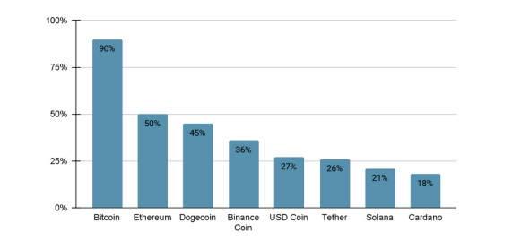

# Market Analysis

In the ever-evolving landscape of cryptocurrency, several trends are currently shaping the market. One prominent trend is the increasing adoption of cryptocurrencies by traditional

financial institutions and corporations. This adoption is fueled by growing recognition of block chain technology's potential to revolutionize various industries, leading to increased investment and integration of digital assets into institutional portfolios.

<figure><figcaption></figcaption></figure>

Above are the best performing cryptocurrencies, ElipeToken will be listed soon and its predicted to perform better than Dogecoin and BinanceCoin

